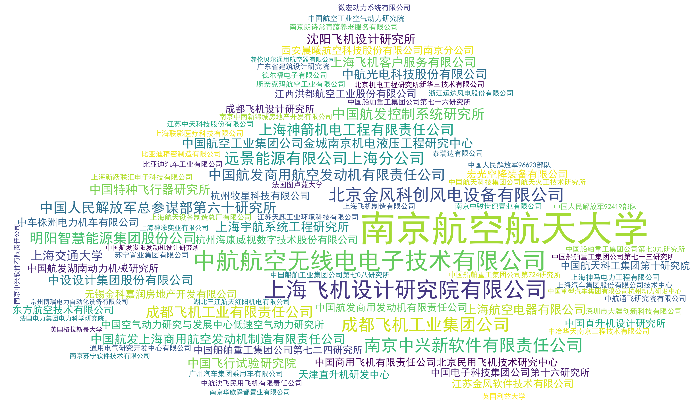
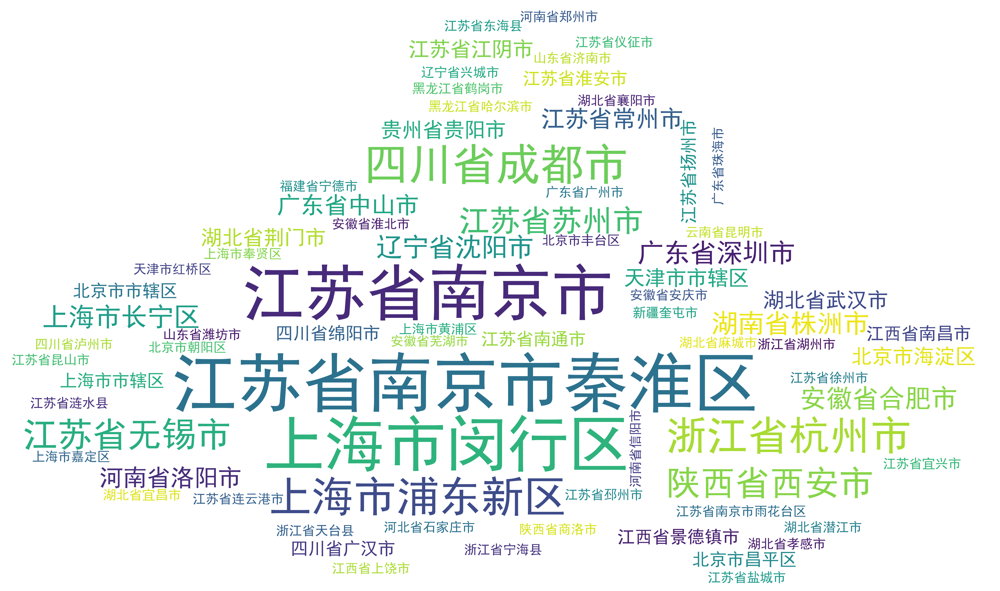

## 基于WordCloud的南京航空航天大学航空宇航学院硕士研究生毕业去向统计

> 图片字体大小对应所占比重大小

> 样本为300位2018届毕业的硕士研究生，统计数据基于学院发布的报到证信息

> 我院2018届待毕业研究生结构为：280位博士研究生（不同年份入学，18年毕业），355位硕士研究生(基本为同一年份入学)，其余55位同学去向未定

> 统计的硕士研究生包含硕士中毕业后转博的同学，统计中不计及280位博士研究生

---

### 个人观点总结
+ 毕业后主要去向（按多少排序）：
  + 升学
  + 航空工业
  + 中船重工&中船工业
  + 机电
  + 能源（远景、金风）
  + 航天
  + CS
  + 中电
+ 算上直升机所，去四大主机所的同学相对很少
+ 没有去BAT的，甚至没有去华为的。少量去中兴的，IT和CS行业招人门槛在提高
+ 工作多为制造业，少量CS，还有几个有想法的去做房地产
+ 地域上，去向以江浙沪为主; 帝都对南航毕业生的吸引力远不及魔都（对应航天和航空）.

### 去向单位

### 去向地域

